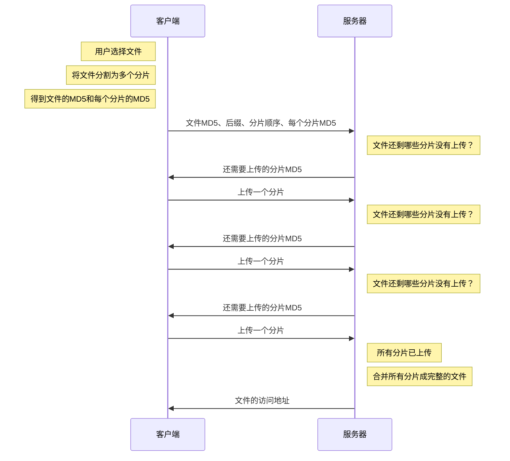

# 网盘上传文件的功能划分

1. **文件秒传**、即系统如果存储了该文件，那么只需要在数据库中添加一条记录链接该文件即可，而不需要再次上传文件
2. **大文件分片上传（断点续传）**、将例如大于20M的文件分割成若干个块，例如5M/块，向服务器上传、服务器再将文件合并保存
3. **文件夹上传**，使用`showDirectoryPicker`函数访问电脑的文件夹，递归遍历文件夹，将文件放入上传队列中，上传时携带文件夹信息，服务端按文件夹保存
4. **上传测速**：用于监测实际的上传速度，也可作为上传进度的参考，这个比较重要（注意fetch无法实现）
5. **文件夹打包成压缩包下载**：服务端应该在接受文件夹下载请求时，将服务端的文件夹压缩为压缩包后提供下载链接给前端
6. **上传任务队列**，可以设置并发任务数量，并发请求提高上传速度（分片上传并不需要队列、因为它一般是等他上一个分片完成之后进行下一个的上传）

## 1.准备工作

对于网盘的一些核心功能，如上文提到的，我打算封装成一个npm包，便于使用，或者通过源码和示例，也能更好的理解网盘的核心实现原理（毕竟咱的时间也不是很多，做项目无非是应付面试的事情罢了）

npm包使用的是我自封装的一个基础模板

https://github.com/Healwrap/hp-rollup-ts-plugin-template

### 1.1 搭建工程

对于该项目，我将项目分为**示例代码区和源码区**，源码经过编译之后，示例代码区可以直接使用build的产物，这样方便开发调试


### 1.2 示例后端服务

示例后端服务可以是多种语言主流的可以是Java或者Node.js，这个完全根据开发者的喜好选择

这里的示例代码中只实现了Node.js版本的示例后端服务：[hp-upload/example/example-server at master · Healwrap/hp-upload (github.com)](https://github.com/Healwrap/hp-upload/tree/master/example/example-server)

### 1.3 示例前端

这里的前端，仅用简短HTML写了一个结构，可以上传文件和文件夹和显示上传过的文件


代码见：[hp-upload/example/example-server at master · Healwrap/hp-upload (github.com)](https://github.com/Healwrap/hp-upload/blob/master/example/index.html)

### 1.4 请求的封装

首先呢，对于上传或者其他接口的交互，都需要用到请求，我们可以使用包括原生在内的XHR和Fetch，也可用框架如Axios

对于项目内的请求，最重要的是能够**获取上传时的速度和进度，这点是封装请求的主要意义**

对于速度和进度的获取，背后原理为Promise的Fetch自然是无法获取的，因此选择使用XHR

这里是一段封装后的示例：详细代码见 [hp-upload/src/request.ts at master · Healwrap/hp-upload (github.com)](https://github.com/Healwrap/hp-upload/blob/master/src/request.ts)


## 2.文件秒传

文件秒传，即系统如果存储了该文件，那么只需要在数据库中添加一条记录链接该文件即可，而不需要再次上传文件

实现文件秒传，需要在系统中以文件MD5作为唯一标识存储
接口方面，小文件或者大文件都需要至少三个接口（即握手、上传、取消）
- 握手：系统应该判断是否有该文件的记录，如果有，直接使用该文件的md5，即在数据库中写入一条记录作为软连接；如果没有，则创建该记录，并返回给前端，前端再上传文件
- 上传：对于小文件，只需要根据握手得到的上传ID进行上传即可，大文件则需要分片上传
- 取消：因为握手阶段已经有了数据库记录，取消的话则需要删除该记录

文件秒传功能存在的文件

- 第一个，创建记录完全根据前端传递的数据来进行判断的，因此，如果恶意伪造的话，可能可以获得其他用户的文件，当然他必须知道md5，握手过程最好是加密的
- 第二个，如果因为意外中断了上传，握手时产生的数据库记录依然在，因此可能需要对创建时间太久如几个小时（因为即便是大文件，也不会这么长时间未上传完）的未上传（status=0）的记录进行清理
- 第三个，如果用户删除了文件，实际上删除的应该是数据库记录，而如果用户恶意伪造大量唯一MD5文件，然后进行删除，系统可能永远也无法清除这些文件，所以需要对文件进行管理，对于没有数据库记录依赖的文件，定期清除

文件秒传功能优点
- 对于用户可节省大量时间，不需要重复上传文件
- 对于系统来讲，如存储常见资源的话，可节省大量存储空间，同时，这个设计对于保存其他用户的分享文件也是很方便的，因为不需要对文件进行操作，而是更新数据库记录即可


## 3.大文件分片上传

整体来说，实现断点上传的主要思路就是把要上传的文件切分为多个小的数据块然后进行上传


下面用一种极其简易的流程实现分片上传



客户端需要的是

1. 计算上传文件的md5和分割文件（注意，这边分块之后的文件一般是没有后缀的）
2. 对于分割的块进行md5计算
3. 将上传的**文件md5和分片文件md5和文件后缀**上传到后端服务器
4. 后端服务器检查是否有该md5文件的信息，有则检查其已上传的块 返回前端
5. 前端再把未上传的块上传到后端
6. 后端拿到所有块之后进行合并

这个流程中，前端到后端首先需要握手(handshake)，
前端根据后端所缺的块进行上传(uploadChunk)
后端拼接文件

对于文件分片，可以使用web worker实现多线程以提升性能
或者使用webAssembly

对于上传分片文件可以设计队列，控制并发请求服务器的数量，减少对服务器的压力

### 2.1 前端文件分片


```js
/**  
 * 对文件进行分片操作  
 * @param file  
 * @returns {Promise<{  
 *     fileId: string,  
 *     ext: string,  
 *     chunks:Blob[],  
 *     time:number  
 * }>}  
 */  
async function spiltFile(file) {  
    return new Promise((resolve) => {  
        /**  
         * 读取下一个分片  
         */  
        function loadNext() {  
            const start = chunkIndex * chunkSize,  
                end = start + chunkSize >= file.size ? file.size : start + chunkSize;  
            fileReader.readAsArrayBuffer(file.slice(start, end));  
        }  
  
        /**  
         * 获取文件的后缀名  
         * @param filename  
         */  
        function extName(filename) {  
            const i = filename.lastIndexOf('.');  
            if (i < 0) {  
                return '';  
            }  
            return filename.substr(i);  
        }  
  
        const currentTime = new Date().getTime();  
        // 分片尺寸（5M）  
        const chunkSize = 1024 * 1024 * 5;  
        // 分片数量  
        const chunkCount = Math.ceil(file.size / chunkSize);  
        // 当前chunk的下标  
        let chunkIndex = 0;  
        // 使用ArrayBuffer完成文件MD5编码  
        const spark = new SparkMD5.ArrayBuffer();  
        const fileReader = new FileReader(); // 文件读取器  
        const chunks = []; // 分片信息数组  
        // 读取第一个分片  
        loadNext()  
        // 读取一个分片后的回调  
        fileReader.onload = function (e) {  
            spark.append(e.target.result) // 分片数据追加到MD5编码器中  
            // 当前分片单独的MD5  
            const chunkMD5 = SparkMD5.ArrayBuffer.hash(e.target.result) + chunkIndex;  
            chunkIndex++;  
            chunks.push({  
                id: chunkMD5,  
                content: new Blob([e.target.result])  
            });  
            if (chunkIndex < chunkCount) {  
                loadNext(); // 继续读取下一个分片  
            } else {  
                // 读取完成  
                const fileId = spark.end();  
                const endTime = new Date().getTime();  
                resolve({  
                    fileId,  
                    ext: extName(file.name),  
                    chunks,  
                    time: endTime - currentTime  
                })  
            }  
        }  
    })  
}
```


### 2.2 接口信息设计

上文介绍到，前端需要将分片文件上传给后端，后端完成拼接。这个过程中需要重复调用上传分片接口，于是前端后端需要一直确认片段数量，接口可设计为：

1. 文件信息协商

路径：`/api/upload/handshake`

方法：`POST`

| 字段名   | 含义                                      | 是否必须 |
| -------- | ----------------------------------------- | -------- |
| fileId   | 文件的MD5编码                             | 是       |
| ext      | 文件的后缀，例如：.jpg                    | 是       |
| chunkIds | 文件分片的编号数组，每个编号是一个MD5编码 | 是       |

**可能的响应**：

```js
{
	code: 0,
  msg: '',
  data: 'http://localhost:8000/upload/a32d18.jpg' // 服务器已有该文件，无须上传
}
```

```js
{
	code: 0,
  msg: '',
  data: ['md5-1', 'md5-2', 'md5-5'] // 服务器还需要上传的分片
}
```

**可能发生的失败响应**：

```js
{
	code: 403,
	msg: '请携带文件编号',
	data: null
}
```


2. 分片上传

路径：`/api/upload`

方法：`POST`

| 字段名  | 含义                  | 是否必须 |
| ------- | --------------------- | -------- |
| file    | 分片的二进制数据      | 是       |
| chunkId | 分片的MD5编码         | 是       |
| fileId  | 分片所属文件的MD5编码 | 是       |

**上传成功的响应**：

```js
{
  code: 0,
  msg: '',
  data: ['md5-2', 'md5-5'] // 服务器还需要上传的分片
}
```

**可能发生的失败响应**：

```js
{
	code: 403,
	msg: '请携带文件编号',
	data: null
}
```


## 4.上传任务队列管理

TODO
